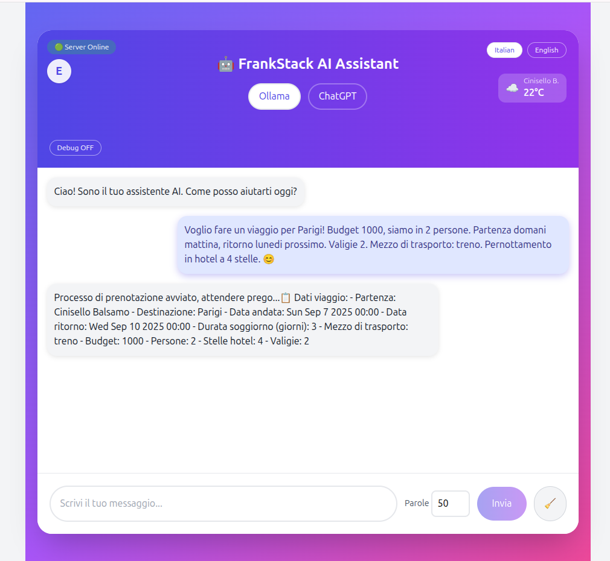

# FrankStack

*Updated: 6 September 2025*

## 🎉 Today's Progress (short)

After countless trials, frustrations, and testing multiple models on an 8 GB CUDA VRAM laptop, we finally reached a **stable version** of the AI interaction pipeline.

* AI snapshot validation & form completeness checks implemented
* Structured printing of all travel form fields
* Integration of Italian-language test scenario for end-to-end verification
* Consistent behavior across multiple test runs

---

### 📋 Booking Process Demo (Italian scenario)

**User question (Italian, for demo purposes):**
`Voglio fare un viaggio per Parigi! Budget 1000, siamo in 2 persone. Partenza domani mattina, ritorno lunedì prossimo. Valigie 2. Mezzo di trasporto: treno. Pernottamento in hotel a 4 stelle. 😊`

**AI response:**
`Processo di prenotazione avviato, attendere prego...`

**📋 Travel Data:**

```
- Departure: Cinisello Balsamo
- Destination: Parigi
- Departure Date: Sun Sep 7 2025 00:00
- Return Date: Wed Sep 10 2025 00:00
- Duration of Stay (days): 3
- Travel Mode: treno
- Budget: 1000
- People: 2
- Hotel Stars: 4
- Luggages: 2
```

**Screenshot reference:**  


### 📦 Available Models (8 GB VRAM CUDA)

```
gemma2:9b-instruct-q4_0                   5.4 GB  
phi4-mini-reasoning:latest                3.2 GB  
llama3.2:1b                               1.3 GB  
qwen2.5:3b                                1.9 GB  
mistral:7b-instruct-v0.2-q4_0             4.1 GB  
adrienbrault/nous-hermes2pro:Q4_0-json    4.1 GB  
gpt-oss:20b                               13 GB  
```

**Screenshot reference:**  


---

*Updated: 29 August 2025*

---

## 🎉 Today's Progress (short)

We made focused progress today:

- Automatic browser-based location detection (GPS).
- Weather integration tied to detected location.
- Session persistence with **Zustand** (stores user session + AI context).
- Built and tested a structured JSON model for AI interactions; parsing pipeline validated.
- Many iterative tests and fixes on the AI prompt / response flow.

---

## 📸 Screenshots & Demo (first impression)

Take a quick look at the AI in action. Edoardo asks the assistant for a trip to Paris — question on the left, AI answer on the right.

| Question | Answer |
|----------|--------|
|  |  |

> **User sample:** `Hi! I'd like to take a trip to Paris! 😊`
> **Assistant (sample):** `Sure Edoardo, could you please let me know ...` (requesting missing fields)

---

## Welcome

**FrankStack** takes inspiration from *Frankenstein*: the monster built from multiple parts becomes a metaphor for a **fullstack project** that integrates all layers of development, from front-end to DevOps. The name also symbolizes the ambition of the project: creating an **end-to-end AI travel agent**, complete, modular, and orchestrated, like a multi-component robot that simulates a real travel booking cycle.

The project was bootstrapped using **Vite**, providing a fast and modern setup for React + TypeScript.

The integrated AI assistant is called:

```
🤖 FrankStack AI Assistant
```

It can answer questions, guide the user, and interact with simulated booking systems.

User session data (chat history, user name, API key) is stored in memory using **Zustand**, allowing persistent state across components during a session.

---

## Ambitious Goal

The challenging goal is to create an **AI travel agent** that:

* Handles a complete booking using the **saga pattern**, with a choreography of API calls
* Interacts with backend services on **AWS Cloud**
* Covers all layers of the stack: React front-end, Spring Boot API, AI, orchestration

### Our Mission:

We want the AI to organize a travel experience like:

> Organize and book a full travel experience for 2 people to Paris to visit the Eiffel Tower, duration 4 days, maximum budget 1500€, 3-star hotel, departing from Milan starting tomorrow, weather permitting, 1 suitcase, and airport-to-hotel shuttle/taxi included.

The AI will analyze the request and return a structured JSON | YAML ready for API booking calls.

> **Note:** the project is still in progress and not yet finished.

---

## React Project Structure

📁 **src/**

* 📁 **components/** – all React components (Header, InputBar, MessageList, MessageBubble, DebugPanel, Button)
* 📁 **hooks/** – custom hooks (`useWeather`, `useServerHealth`, `useAI`)
* 📁 **pages/** – main pages (`Chat.tsx`, `Home.tsx`)
* 📁 **store/** – **Zustand store** (`useAuthStore.ts`) for user session management
* 📁 **types/** – shared TypeScript types (`chat.ts`)
* 📁 **utils/** – utility functions (`contextBuilder.ts`, `datetime.ts`, `weatherCodes.ts`)
* index.css – global styles
* App.tsx – root React component
* main.tsx – entry point

---

## Pipeline Overview

```text
[React Front-End (Vite)] 
      │
      ▼
[Zustand Store: user session, API key, chat state]
      │
      ▼
[Spring Boot API / Node Server] <─┐
      │                          │
      ▼                          │
[Ollama AI GPT-OSS 20B]           │
      │                          │
      ▼                          │
[Saga Pattern / Choreography of API Calls] 
      │
      ▼
[AWS Cloud Services / Orchestration]
      │
      ▼
[User Receives Complete Travel Booking]
```

* Front-end sends requests via React UI
* **Zustand store** keeps track of the user session and chat state
* API handles communication with AI and cloud services
* AI interprets user input and returns structured JSON | YAML
* Saga pattern executes chained booking actions
* AWS orchestrates services ensuring end-to-end flow

---

## User Session Management with Zustand

```text
[User Input / Chat Component] 
        │
        ▼
[Zustand Store: useAuthStore] 
   ├─ currentUser: "Edoardo"
   ├─ apiKey: "********"
   ├─ chatMessages: [...]
   └─ other session state
        │
        ▼
[All React Components] 
(Header, InputBar, MessageList, DebugPanel)
        │
        ▼
[UI Updates in Real-Time]
```

* The **Zustand store** acts as a centralized memory for the session.
* Components subscribe to store state and automatically re-render when relevant data changes.
* Allows persistent user session across multiple UI components **without prop drilling**.
* Similar concept to Redux, but lightweight and easier to use for small-to-medium fullstack projects.

---

## Getting Started (3 Terminals)

FrankStack covers **the full stack**: Front-end, Back-end, AI + Orchestration.
To run correctly, **use three separate terminals**.

---

### 1️⃣ Front-End (React / Vite)

```bash
cd ~/Java/FrankStack/frank-react-vite
./start.sh  # installs dependencies and runs the front-end at http://localhost:5173
```

### 2️⃣ Back-End (Node / Spring Boot API)

```bash
cd ~/Java/FrankStack/frank-node-server
npm install      # install all dependencies
node server.js   # start the Node server
```

⚠️ Make sure Ollama is available before starting the server, otherwise AI calls will fail.

### 3️⃣ DevOps / AI (Ollama + LocalStack)

```bash
cd ~/Java/FrankStack/frank-ops
./startaws.sh     # start LocalStack
./startollama.sh  # start Ollama container with models
```

> This terminal handles external services: Ollama for AI and LocalStack to simulate AWS.

---

## Tech Stack

* **Front-end:** React + TypeScript + TailwindCSS + **Vite**
* **State management:** **Zustand** (user session)
* **AI:** Ollama with GPT-OSS 20B
* **Back-end:** Spring Boot API / Node server orchestrated on AWS
* **DevOps:** cloud orchestration, end-to-end API call management
* **Debug & Logs:** real-time debug panel

---

## Contribution

FrankStack is an end-to-end demo of **fullstack AI orchestration**.
Every part of the stack is observable and editable, using **Scrum methodology**, showcasing modern development practices.

---
